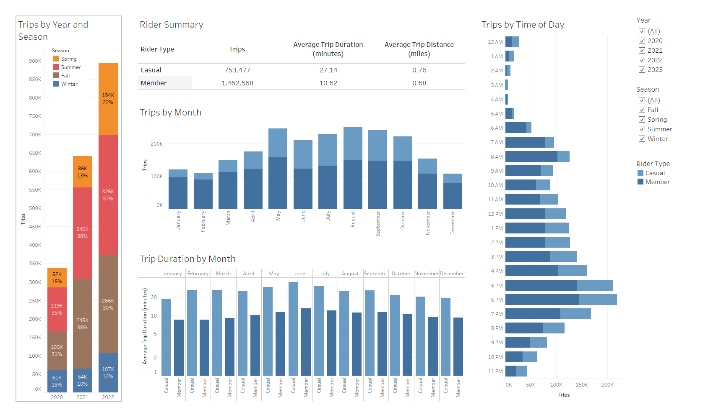

file:///c%3A/Users/jeffd/OneDrive/Desktop/Classwork/Homework/18-tableau-city-bike/README.md {"mtime":1697429537417,"ctime":1696452039541,"size":6615,"etag":"3bbjcgfjb6rc","orphaned":false,"typeId":""}
# City Bike Analysis with Tableau

## Background

Congratulations on your new job! As the new lead analyst for the New York Citi BikeLinks to an external site. program, you are now responsible for overseeing the largest bike-sharing program in the United States. In your new role, you will be expected to generate regular reports for city officials looking to publicize and improve the city program.

Since 2013, the Citi Bike program has implemented a robust infrastructure for collecting data on the program's utilization. Each month, bike data is collected, organized, and made public on the Citi Bike DataLinks to an external site. webpage.

However, while the data has been regularly updated, the team has yet to implement a dashboard or sophisticated reporting process. City officials have questions about the program, so your first task on the job is to build a set of data reports to provide the answers.

## Tableau Workbook

Please find the following link to the public Tableau workbook with interactive dashboards:
https://public.tableau.com/app/profile/jeff.dubois/viz/Citi-Bike-Challenge_16971814550940/Story. Please note that a downloaded version of this workbook is located in this repository.

## Instructions
Your task in this assignment is to aggregate the data found in the Citi Bike Trip History Logs and find two unexpected phenomena.

1. Design 2–5 visualizations for each discovered phenomenon (4–10 total). You may work with a timespan of your choosing. Optionally, you can also merge multiple datasets from different periods.
2. Use your visualizations (not necessarily all of them) to design a dashboard for each phenomenon. The dashboards should be accompanied by an analysis explaining why the phenomenon may be occurring.
3. Create one of the following visualizations for city officials:
- Basic: A static map that plots all bike stations with a visual indication of the most popular locations to start and end a journey, with zip code data overlaid on top.
- Advanced: A dynamic map that shows how each station's popularity changes over time (by month and year). Again, with zip code data overlaid on the map.
- The map you choose should also be accompanied by a write-up describing any trends that were noticed during your analysis.
4. Create your final presentation:
- Create a Tableau story that brings together the visualizations, requested maps, and dashboards.
- Ensure your presentation is professional, logical, and visually appealing.

## Data Cleaning and Transformation
1. The first step in the project was to decide on the time period for analysis and then download all of the corresponding monthly csv files from the [Citi Bike Data](https://citibikenyc.com/system-data) webpage. The original time period was 2018 through 2023, but this was reduced to 2020 to 2023 based on performance issues during testing in Tableau.
2. The next step was to create a Jupyter notebook to clean and merge the files into one csv file. This file is the data source for the Tableau workbook. This process is described below.
    -  Read each monthly csv file into a dataframe and create a list with every dataframe. This was not a simple process as the structure of files changed in February 2021. Several columns were eliminated (tripduration, bikeid, birth year, gender), two were added (ride_id and rideable_type), the values for usertype changed, and every column name was changed. As illustrated below, two functions were used; one to read the csv file into a dataframe and the other to use that function to read each monthly file for an entire year and reorganize each dataframe into a consistent structure. Note the dataframes were reorganized based on the structure for files after January 2021. And finally, the second function was called in a loop to create a list of monthly dataframes for each year and then add them to one final list of all of the dataframes.
    

    - Concatenate the list into one dataframe.
    

    - Review the dataframe and inspect rows with missing data.
    

    - Remove the rows with missing data given they cannot be analyzed with station information missing.
    

    - Export the dataframe to a csv file.
    

## Tableau Visualizations
Fifteen worksheets were created to analyze and visualize the dataset. These were organized into three dashboards along with a home page described below.

### Home Page
The home page provides information on the dataset and an overview of each dashboard. 

### Rider Dashboard
This dashboard explores patterns of casual riders and members analyzing the number of trips by the hour of the day and month of the year as well as the average trip duration per month. These can be filtered by year and season. The dashboard also includes an overall view of trips by year and season from 2018 to 2022.

### Station Dashboard
This dashboard provides some basic information about the stations and focuses on the ten most most popular stations to start and end a trip. These trips are separated between casual riders and members and trips between the most popular start and end stations are analyzed. As with the rider dashboard, these visualizations can be filtered by year and season.

### Map Dashboard
This dashboard displays the start and end stations on separate maps with the size of the marker indicating the total number of trips and the color indicating if the station was one of the ten most popular. The map can also be filtered by year, season and rider type. 

## Analysis

From 2020 to 2023, there were roughly 2.2 million trips with casual rider trips totaling just over 1/2 of member trips. The average trip distance for casual riders was slightly higher than members, but the trip duration was 2.5 times longer than member riders and almost 4 times longer in 2020. Information regarding the riders was unavailable, but it is likely that many casual riders are tourists using Citi Bikes for sightseeing while members are using them for commuting to work or regular trips to specific locations.

Between 2020 and 2022, the number of trips increased from 337K to 898K. This is due to several factors including the pandemic as well as successive increases in the number of stations between May 2020 and 2023 (https://en.wikipedia.org/wiki/Citi_Bike). Not surprisingly, the most trips occurred during the summer followed by fall, spring, and winter.

Delving into trips by the time of day reveals that most trips occurred between 5pm and 7pm with a small spike in the morning during commuter hours. This trend is primarily due to member trips which reinforces the use of Citi Bikes for commuting to and from work. Casual rides were highest during those times as well but more eveningly spread across the day. 

Excluding 2023 as it only accounts for half of the year, the number of trips is visually similar to a skewed bell curve with the most trips in August. This is likely due to the seasonal weather in the area. The exception to this pattern occurred in 2020 with the lowest number of trips in April when Covid restrictions were in full effect. The trip duration by month reflects the longer trips by casual riders though it is interesting that the longest trips for those riders are in February rather than during the spring and summer. 

In reviewing the subsequent station maps, it becomes clear that the disparity is a result of the dataset containing start locations for Jersey City while the end stations include cities within New York. This is not noted on the Citi Bike Data webpage though most of the monthly csv files start with the letters JC. The trips which ended outside of Jersey City most likely started in Jersey City though this was not analyzed and confirmed from the data. 

The 10 most popular start stations (based on the number of trips) mirrored the 10 most popular end stations and all of them are located at or near public transit services including the Path train to New York City, the Hoboken terminal, and the Hudson-Bergen Light Rail train.  

Exploring the trips between the most popular stations reveals that highest number of trips for the majority of the stations started and ended at that station. Possible explanations include local points of interest, tourism,  and the usage of the nearby transit services to travel to and from other locations. Ranked 9th, the Liberty Light Rail had the highest number of trips to and from it. This may be due to it's proximity to the 36 acre Liverty State Park with many bike paths and walkways. This is supported by the station not making the top 10 during the fall and winter months.

As stated earlier, the maps of the start and end stations clearly illustrate that the starting locations are limited to Jersey City while the ending stations extend into New York City and beyond. This affirms the use of Citi Bikes in combination with public transit. It is also interesting to note that Liberty Light Rail is not one of the top 10 stations for members which would support the use of this station for travel to the state park. 

## Conclusion

The interactive dashboards and visualizations provide a valuable tool for analyzing trends in Citi Bike usage between 2020 and 2023. These dashboards are not comprehensive and there are many other areas that could be explored. One example would be isolating new stations to determine usage over time to validate the need for the station. Another would be analyzing the most frequent trips and station usage to identify possible locations for new stations.

From this project, some key lessons learned included:
- Tableau is very user-friendly though it requires some time to understand the best way to create certain visualizations and ensure that it's representing what you want correctly. With further usage, it would not be surprising to find that this user-friendless comes at the cost of some functionality as compared to Matplotlib, Plotly, Leaflet and other visualization tools.
- Given Tableau's file size limitations, it is critical to only include necessary data fields and determine the best schema to minimize file size and maximize Tableau's performance. Another consideration when using many calculated fields is the potential performance benefit of converting some of those fields to columns storing the calculated values. 
- Creating two csv files, one with station information and one with trips would have reduced the workbook's file size and allowed for better analysis of the relationship of trips between stations. As an example, the top 10 start and end stations could have been represented on one map with variations in marker color indicating a station in the top 10 for both start and stop, top 10 in either start or stop or not in the top 10 for both.
- Reorganizing and cleaning data in which the structure changed over time is time-consuming but not difficult when utilizing Pandas in a Jupyter notebook. Pandas and Python are both powerful tools to read in data and transform it for other uses and applications.

## Repository Contents
This Github repository contains the following folders and files:
1. images - Folder for images used in this readme file.
2. citi_bike_challenge.twbx - Downloaded copy of public Tableau workbook.
3. citi_bike_data_prep.ipynb - Jupyter notebook used to clean and merge the files into one csv file.
4. README.md - This file.

Note: The following folders were not uploaded to Github given storage limits.
1. data - Folder for the csv file exported in the Jupyter notebook.
2. resources - Folder for Citi Bike montly csv files.